# AITasker Frontend Screen-Flow Diagrams and Route Documentation

**Basis:** `frontend/src/App.tsx`, `frontend/src/lib/route-guards.tsx`, and the frontend component structure in the supplied AITasker codebase snapshot.

**Authoritative route count:** **101 route-addressable screen entries**

- Public and handoff routes: **4**
- CEO portal routes: **31**
- Expert portal routes: **28**
- Tech Team portal routes: **16**
- Admin portal routes: **21**
- Wildcard error route: **1**

> The 101-screen figure counts route entries, including index routes and parameterized routes. It does **not** count dashboard shell components, modals, drawers, inline editors, wizard stages, loading views, empty states, or status-specific subcomponents as separate routed screens.

---


## Revision note — CEO Expert Profile route

This revision incorporates the newly added route:

```text
/ceo/experts/:userId
→ CeoExpertProfileView
```

The route fixes the CEO-side **View Profile** 404 and increases the frontend route count from **100 to 101**. The screen uses the existing public-profile, user-reviews, domain-config, and seam-config reads; it does not add a new backend endpoint.

---

## 1. Diagram conventions

| Symbol | Meaning |
|---|---|
| `[Sxxx]` | Route-addressable screen from `App.tsx` |
| `[[Lxxx]]` | Dashboard/layout shell containing an `<Outlet />`; not counted as a screen |
| `(Wxxx)` | Non-routed wizard stage or state |
| `(Cxxx)` | Embedded component, panel, editor, or form |
| `(Mxxx)` | Modal or confirmation component only where the codebase provides clear modal/confirmation evidence |
| `(Gxxx)` | Route guard or authentication state |
| `-->` | Verified route-tree relationship or expected user navigation |
| `-.->` | Conditional, state-driven, or implementation-dependent transition |

### Evidence rule

The diagrams distinguish three kinds of claims:

1. **Route-grounded:** The URL and routed component are explicitly declared in `App.tsx`.
2. **Component-grounded:** The component exists in the codebase but is rendered inside another route.
3. **Expected navigation:** The transition is a logical business-flow transition inferred from route purpose or component naming. QA must confirm the actual clickable control and navigation implementation.

---

# 2. Global routing, authentication, and fallback behavior

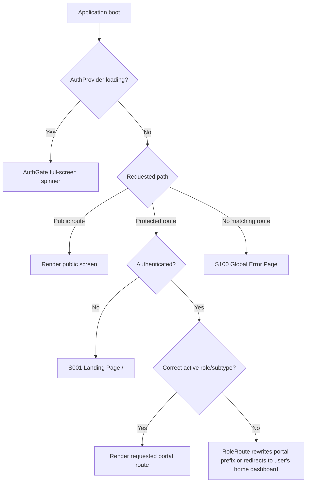

## Guard behavior

### `AuthGate`

A full-screen loading state shown while authentication rehydration is still resolving. It prevents route guards from redirecting before the current-user request completes.

### `ProtectedRoute`

- Authenticated users continue to protected routes.
- Unauthenticated users are redirected to `/`.
- Unauthorized requests do **not** automatically go to the wildcard 404 route.

### `RoleRoute`

- CEO routes require active role `CLIENT` and subtype `CEO`.
- Tech Team routes require active role `CLIENT` and subtype `TECH_TEAM`.
- Expert routes require active role `EXPERT`.
- Admin routes require active role `ADMIN`.
- A wrong-role user is redirected toward their own portal.
- Where possible, the implementation rewrites the portal prefix while preserving the remainder of the path.

### Wildcard route

Only a path that matches no declared route reaches:

```text
*
→ ErrorPage
```

---

# 3. Public and technical-handoff flow

## 3.1 Screen-flow diagram

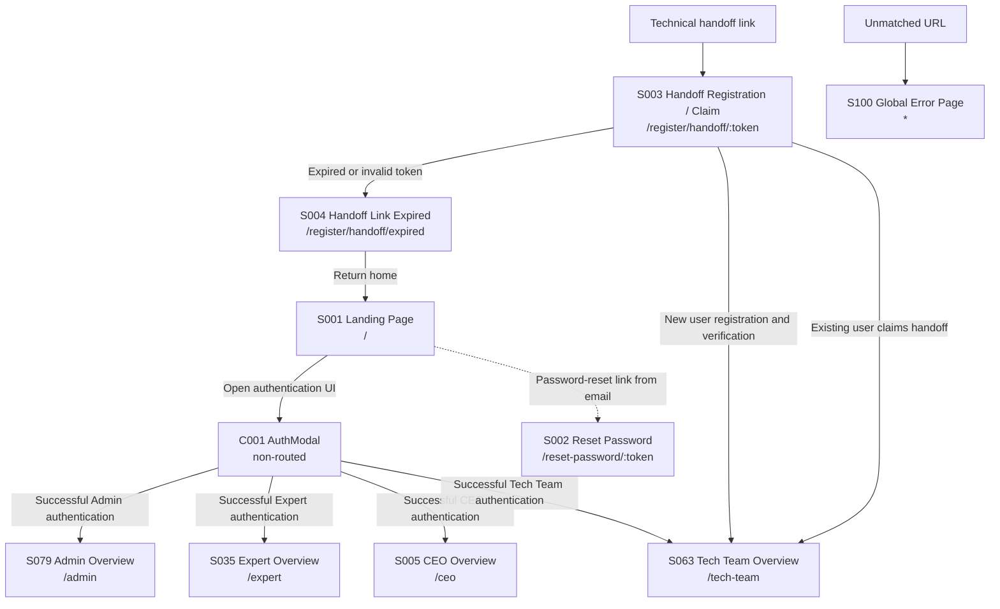

## 3.2 Public route inventory

| ID | Route | Routed component | Screen purpose | Entry condition | Expected exits |
|---|---|---|---|---|---|
| S001 | `/` | `LandingPage` | Public landing page and authentication entry surface. | Any visitor; unauthenticated users redirected here from protected routes. | Authentication UI, portal dashboard after login, or public content actions. |
| S002 | `/reset-password/:token` | `ResetPasswordPage` | Validate a password-reset token and submit a new password. | User follows reset link containing a token. | Successful reset normally returns to authentication/landing; invalid or expired token remains an error state. |
| S003 | `/register/handoff/:token` | `HandoffRegister` | Register a new Tech Team user or claim a delegated technical handoff. | User follows CEO-generated handoff link. | Tech Team portal on success; expired-link page on invalid/expired handoff. |
| S004 | `/register/handoff/expired` | `LinkExpiredError` | Explain that the handoff token cannot be used. | Redirect from failed handoff validation or direct navigation. | Return to landing page or request a new handoff outside this screen. |
| S100 | `*` | `ErrorPage` | Catch unmatched URLs. | No route pattern matches. | User-selected recovery navigation. |

## 3.3 Non-routed authentication states

The codebase contains `AuthModal.tsx` and `ChangePasswordModal.tsx`. Authentication modes such as sign-in, registration, forgot-password initiation, and OTP verification should be documented as **states inside the authentication component**, not as route-addressable screens unless runtime behavior proves otherwise.

QA should verify:

- Opening and closing the authentication UI.
- Switching between login and registration modes.
- OTP verification and resend behavior.
- Forgot-password submission.
- Correct portal destination based on active role/subtype.
- Browser refresh during authentication rehydration.
- Direct navigation to protected routes while logged out.

---

# 4. CEO portal

## 4.1 CEO route tree

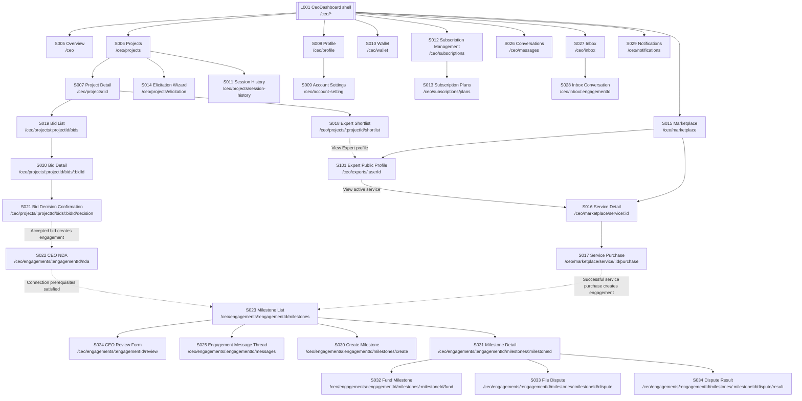

## 4.2 CEO elicitation subflow

`ElicitationWizard` is one routed screen containing several non-routed workflow stages.

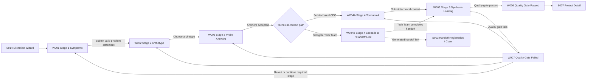

### Elicitation documentation

**Route:** `/ceo/projects/elicitation`  
**Routed component:** `ElicitationWizard`

**Embedded components confirmed by the codebase:**

- `Stage1Symptoms`
- `Stage2Archetype`
- `Stage3Probes`
- `Stage4ScenarioA`
- `Stage4ScenarioB`
- `Stage4HandoffLink`
- `Stage5Loading`
- `QualityGatePassed`
- `QualityGateFailed`

**QA focus:**

- Stage progression and back-navigation.
- Draft persistence via explicit draft calls.
- Refresh/re-entry behavior.
- Self-technical and delegated branches.
- Handoff-link generation and expiration.
- Stage 5 loading, success, failure, and retry.
- Returned-session routing to the correct earlier stage.
- Prevention of duplicate synthesis submissions.

## 4.3 CEO route catalog

| ID | Route | Component | Classification | Primary responsibility |
|---|---|---|---|---|
| S005 | `/ceo` | `CeoOverview` | Index screen | CEO dashboard summary and entry point to primary workflows. |
| S006 | `/ceo/projects` | `ProjectsPage` | Collection screen | List projects and enter project creation, history, or detail flows. |
| S007 | `/ceo/projects/:id` | `ProjectDetailPage` | Detail screen | View project specification, project state, shortlist, bids, and project-level actions. |
| S008 | `/ceo/profile` | `UserProfilePage` | Profile screen | View the current user's public/profile information. |
| S009 | `/ceo/account-setting` | `ProfileSettingPage` | Settings screen | Edit account/profile data and security-related settings. |
| S010 | `/ceo/wallet` | `WalletPage` | Financial screen | View CEO wallet balance, transactions, and top-up controls. |
| S011 | `/ceo/projects/session-history` | `SessionsListPage` | Collection/history screen | View, continue, revert, abandon, or delete elicitation sessions. |
| S012 | `/ceo/subscriptions` | `SubscriptionManagement` | Subscription screen | View current tier, status, and subscription history/actions. |
| S013 | `/ceo/subscriptions/plans` | `SubscriptionPlans` | Selection screen | Compare and activate available subscription packages. |
| S014 | `/ceo/projects/elicitation` | `ElicitationWizard` | Wizard host | Run the multi-stage project elicitation workflow. |
| S015 | `/ceo/marketplace` | `MarketplaceBrowse` | Marketplace collection | Browse published service listings. |
| S016 | `/ceo/marketplace/service/:id` | CEO `ServiceDetail` | Marketplace detail | Inspect one service listing before purchase. |
| S017 | `/ceo/marketplace/service/:id/purchase` | `ServicePurchase` | Checkout screen | Create and pay for a service purchase. |
| S101 | `/ceo/experts/:userId` | `CeoExpertProfileView` | Public Expert profile detail | View an Expert's public identity, rating, reviews, domain depth, seam claims, stack, engagement mode, and active service listings. |
| S018 | `/ceo/projects/:projectId/shortlist` | `ShortlistView` | Ranked collection | Review matched Experts and initiate invitations. |
| S019 | `/ceo/projects/:projectId/bids` | `BidList` | Collection screen | List bids submitted for a project. |
| S020 | `/ceo/projects/:projectId/bids/:bidId` | `BidDetail` | Detail/negotiation screen | Review technical/commercial bid details and offers. |
| S021 | `/ceo/projects/:projectId/bids/:bidId/decision` | `BidDecisionConfirm` | Confirmation screen | Confirm the CEO's final bid decision. |
| S022 | `/ceo/engagements/:engagementId/nda` | CEO `NdaClickThrough` | Agreement screen | Record CEO NDA acceptance for an engagement. |
| S023 | `/ceo/engagements/:engagementId/milestones` | CEO `MilestoneList` | Workspace collection | View and manage engagement milestones. |
| S024 | `/ceo/engagements/:engagementId/review` | `CeoReviewForm` | Form screen | Submit the CEO-side engagement review. |
| S025 | `/ceo/engagements/:engagementId/messages` | `MessageThread` | Conversation screen | View an engagement-scoped message thread. |
| S026 | `/ceo/messages` | `ConversationsList` | Conversation collection | View CEO conversations. |
| S027 | `/ceo/inbox` | `InboxPage` | Unified inbox | View inbox without a selected engagement. |
| S028 | `/ceo/inbox/:engagementId` | `InboxPage` | Parameterized inbox | Open the inbox with a specific engagement selected. |
| S029 | `/ceo/notifications` | `NotificationSystem` | Notification collection | View and manage persisted notifications. |
| S030 | `/ceo/engagements/:engagementId/milestones/create` | `CreateMilestone` | Creation screen | Create or bulk-initialize milestones. |
| S031 | `/ceo/engagements/:engagementId/milestones/:milestoneId` | CEO `MilestoneDetail` | Detail/review screen | Inspect milestone terms, DoD, criteria, submissions, and review actions. |
| S032 | `/ceo/engagements/:engagementId/milestones/:milestoneId/fund` | `FundMilestone` | Payment screen | Initiate milestone funding and display payment status. |
| S033 | `/ceo/engagements/:engagementId/milestones/:milestoneId/dispute` | `DisputeFile` | Form screen | File a dispute for the selected milestone. |
| S034 | `/ceo/engagements/:engagementId/milestones/:milestoneId/dispute/result` | `DisputeResult` | Result screen | View dispute status and resolution result. |

## 4.4 CEO Expert Public Profile screen

### Route-grounded definition

**Screen ID:** S101  
**Route:** `/ceo/experts/:userId`  
**Routed component:** `CeoExpertProfileView`  
**Source file:** `frontend/src/features/ceo/experts/CeoExpertProfileView.tsx`  
**Guard:** CEO portal guard (`CLIENT` role with `CEO` subtype)

### Entry points

The primary intended entry is the **View Profile** action on an Expert card. Depending on the host component, this may be exposed from:

- CEO marketplace Expert cards.
- Project shortlist/matching cards.
- Other CEO-facing Expert directory surfaces added later.

The route parameter is the target Expert's **user ID**, not an expert-profile row ID.

### Data dependencies

The screen performs four independent reads:

| Hook | Backend operation | Purpose |
|---|---|---|
| `usePublicProfile(userId)` | `GET /users/{userId}/public-profile` | Load public identity, Expert profile summary, domain depths, seam claims, ratings, and active listings. |
| `useUserReviews(userId)` | `GET /reviews/users/{userId}` | Load reviews received by the Expert. |
| `useDomains()` | `GET /config/domains` | Resolve domain codes into display names. |
| `useSeams()` | `GET /config/seams` | Resolve seam codes into display names. |

### Visible states

1. **Loading**
   - Full-width centered spinner while the public-profile query is loading.
2. **Profile not found/error**
   - Displays “Expert Profile Not Found.”
   - Provides a **Go Back** action using browser-history navigation.
3. **Loaded profile**
   - Initial/avatar fallback.
   - Full name.
   - Average rating and review count.
   - Engagement mode.
   - Bio, when present.
   - Tech-stack tags.
   - Domain-depth cards.
   - Seam claims with `Verified` or `Claimed` presentation.
   - Active services.
   - Client reviews.
4. **Empty optional sections**
   - Bio, stack, domains, seams, or services are omitted when empty.
   - Reviews show an explicit empty-state card.

### Outgoing navigation

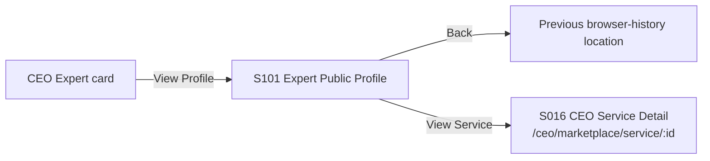

### QA scenarios

#### Positive path

1. Sign in as a CEO.
2. Open a CEO page containing an Expert card.
3. Click **View Profile**.
4. Confirm navigation to `/ceo/experts/{userId}`.
5. Confirm exactly one public-profile request for the selected user.
6. Confirm reviews, domain definitions, and seam definitions load.
7. Verify the displayed name, rating, engagement mode, bio, stack, domains, seams, active services, and reviews against backend responses.
8. Click an active service and confirm navigation to `/ceo/marketplace/service/{serviceId}`.
9. Use **Back** and confirm browser-history return.

#### Empty-data variants

Test an Expert with:

- No bio.
- No stack tags.
- No domain-depth rows.
- No seam claims.
- No active service listings.
- No reviews.
- No average rating.

The screen must remain usable and must not show undefined/null values.

#### Verification-tier variants

Validate at least:

- `EVIDENCE_BACKED` → `Verified`
- `VERIFIED` → `Verified`
- Any other claim tier → `Claimed`

#### Security and authorization

- Logged-out deep link should be redirected by the protected route.
- Expert, Tech Team, and non-CEO Client sessions should be redirected or denied by the role guard.
- A CEO must not receive private Expert fields such as bank data, internal evaluation payloads, hidden portfolio evidence, tax data, or administrative flags.
- Changing `userId` must not expose a suspended/private profile beyond what the backend public-profile contract permits.
- Invalid and non-existent user IDs must render the error state without crashing.

#### Failure isolation

Because the screen performs multiple queries, QA should test:

- Public profile fails: show the profile-not-found/error state.
- Reviews fail while profile succeeds: verify whether the screen degrades safely instead of crashing.
- Domain definitions fail: raw domain codes may be used as fallback.
- Seam definitions fail: raw/formatted seam codes may be used as fallback.
- Slow reviews/config requests: core profile should not be blocked after public-profile success unless the hook implementation couples loading states.

#### Accessibility and interaction

- Back button has an accessible label or recognizable icon/button text.
- Service buttons are keyboard reachable.
- Rating and verification status are understandable without relying solely on color.
- Long bios and large stack lists wrap correctly.
- Mobile and desktop layouts remain readable.

### Documentation impact

This route resolves the former CEO Expert-profile 404 path. It increases the frontend route denominator by one:

- CEO routes: **30 → 31**
- Whole frontend: **100 → 101**
- NestJS endpoint denominator: unchanged at **222**
- FastAPI endpoint denominator: unchanged at **12**

## 4.5 CEO embedded states and components

The following are not separate routes:

- `MilestoneChatAssistant`
- `AcceptanceCriteriaEditor`
- `CriteriaVerify`
- `RevisionRequest`
- `DoDEditor`
- `EngagementActivity`
- `CounterOfferPanel`
- `ConnectionPending`
- `JointMilestoneWait`
- `VietQRPanel`
- shared toast, error, loading, and empty states

They should appear in test cases as controls or states belonging to their host route.

---

# 5. Expert portal

## 5.1 Expert route tree

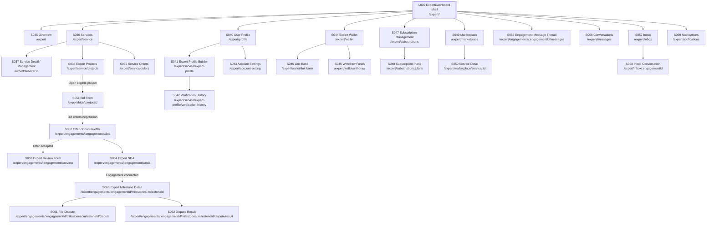

> Important: there is no separate routed Expert milestone-list page in `App.tsx`. The Expert route enters a specific milestone detail using both `engagementId` and `milestoneId`.

## 5.2 Expert route catalog

| ID | Route | Component | Classification | Primary responsibility |
|---|---|---|---|---|
| S035 | `/expert` | `ExpertOverview` | Index screen | Expert dashboard summary. |
| S036 | `/expert/service` | `ExpertServicesPage` | Collection/management screen | List and manage the Expert's service listings. |
| S037 | `/expert/service/:id` | Expert `ServiceDetail` | Detail/management screen | Inspect or manage one owned service listing. |
| S038 | `/expert/service/projects` | `ExpertProjectsPage` | Project hub | View project opportunities, invitations, and related project work. |
| S039 | `/expert/service/orders` | `ExpertOrdersPage` | Order collection | View service-purchase orders associated with the Expert. |
| S040 | `/expert/profile` | `UserProfilePage` | Profile screen | View current user profile. |
| S041 | `/expert/service/expert-profile` | `ExpertProfilePage` | Profile builder | Manage Expert-specific domains, seams, stack, engagement model, and bio. |
| S042 | `/expert/service/expert-profile/verification-history` | `VerificationHistoryPage` | Verification history | View portfolio evaluation attempts and outcomes. |
| S043 | `/expert/account-setting` | `ProfileSettingPage` | Settings screen | Edit shared account and security settings. |
| S044 | `/expert/wallet` | `ExpertWallet` | Financial screen | View available balance, pending amounts, bank-link state, and withdrawals. |
| S045 | `/expert/wallet/link-bank` | `BankHubLink` | Bank-link screen | Initiate and complete bank-account linking. |
| S046 | `/expert/wallet/withdraw` | `WithdrawForm` | Withdrawal form | Create a withdrawal request. |
| S047 | `/expert/subscriptions` | Expert `SubscriptionManagement` | Subscription screen | View current Expert subscription state. |
| S048 | `/expert/subscriptions/plans` | Expert `SubscriptionPlans` | Selection screen | Compare and activate Expert plans. |
| S049 | `/expert/marketplace` | `MarketplaceBrowse` | Marketplace collection | Browse service listings using the shared marketplace component. |
| S050 | `/expert/marketplace/service/:id` | CEO marketplace `ServiceDetail` | Marketplace detail | View a service listing from the Expert portal route. |
| S051 | `/expert/bids/:projectId` | `BidForm` | Bid creation screen | Submit a project bid with alignment, approach, and pricing. |
| S052 | `/expert/engagements/:engagementId/bid` | `CounterOfferReceived` | Negotiation screen | Review, accept, decline, or reconcile offers. |
| S053 | `/expert/engagements/:engagementId/review` | `ExpertReviewForm` | Form screen | Submit Expert-side review. |
| S054 | `/expert/engagements/:engagementId/nda` | Expert `NdaClickThrough` | Agreement screen | Record Expert NDA acceptance. |
| S055 | `/expert/engagements/:engagementId/messages` | `MessageThread` | Conversation screen | View engagement-specific messages. |
| S056 | `/expert/messages` | `ConversationsList` | Conversation collection | View Expert conversations. |
| S057 | `/expert/inbox` | `InboxPage` | Unified inbox | View inbox without a selected engagement. |
| S058 | `/expert/inbox/:engagementId` | `InboxPage` | Parameterized inbox | View inbox focused on one engagement. |
| S059 | `/expert/notifications` | `NotificationSystem` | Notification collection | View and update Expert notifications. |
| S060 | `/expert/engagements/:engagementId/milestones/:milestoneId` | `ExpertMilestoneDetail` | Execution workspace | Manage DoD, stage documents, submit/retract deliverables, and inspect milestone state. |
| S061 | `/expert/engagements/:engagementId/milestones/:milestoneId/dispute` | `DisputeFile` | Form screen | File an Expert-side milestone dispute. |
| S062 | `/expert/engagements/:engagementId/milestones/:milestoneId/dispute/result` | `DisputeResult` | Result screen | View dispute status and resolution. |

## 5.3 Expert non-routed workflow components

Component-grounded embedded states include:

- `ServiceCreateModal`
- `AIGeneratorFlow`
- `ServiceListingsGrid`
- `ServiceManage`
- `FootprintAlignment`
- `ApproachSummary`
- `ConditionalPricing`
- `DomainDepthGrid`
- `SeamClaimsGrid`
- `StackTagsPicker`
- `PortfolioSubmitForm`
- `Tier2Success`
- `Tier2Rejected`
- `VerificationLockout`
- `DodChecklist`
- `DodItemRow`
- `DeliverableSubmit`
- `PaygatedDocsStaging`
- `MilestoneApproved`
- `MilestoneInRevision`
- `ArtifactBView`

QA must test these under their owning routed screens rather than count them as additional pages.

---

# 6. Tech Team portal

## 6.1 Tech Team route tree

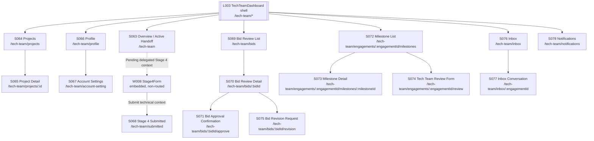

## 6.2 Tech Team route catalog

| ID | Route | Component | Classification | Primary responsibility |
|---|---|---|---|---|
| S063 | `/tech-team` | `TechTeamOverview` | Index screen | Show Tech Team summary and state-driven delegated handoff work. |
| S064 | `/tech-team/projects` | `TechTeamProjectsPage` | Project collection | List projects associated with the Tech Team user. |
| S065 | `/tech-team/projects/:id` | `TechTeamProjectDetailPage` | Project detail | Review project technical context and permitted artifacts. |
| S066 | `/tech-team/profile` | `UserProfilePage` | Profile screen | View Tech Team user profile. |
| S067 | `/tech-team/account-setting` | `ProfileSettingPage` | Settings screen | Edit shared user/account settings. |
| S068 | `/tech-team/submitted` | `Stage4Submitted` | Completion screen | Confirm delegated Stage 4 technical-context submission. |
| S069 | `/tech-team/bids` | `BidReviewList` | Review collection | List bids requiring technical review. |
| S070 | `/tech-team/bids/:bidId` | `BidReviewDetail` | Review detail | Inspect one bid and choose approval or revision. |
| S071 | `/tech-team/bids/:bidId/approve` | `BidApprove` | Confirmation screen | Confirm technical approval. |
| S072 | `/tech-team/engagements/:engagementId/milestones` | Tech Team `MilestoneList` | Milestone collection | List milestones requiring technical participation. |
| S073 | `/tech-team/engagements/:engagementId/milestones/:milestoneId` | Tech Team `MilestoneDetail` | Technical review screen | Review submission, criteria, documents, and revision/sign-off actions. |
| S074 | `/tech-team/engagements/:engagementId/review` | `TechTeamReviewForm` | Form screen | Submit Tech Team review. |
| S075 | `/tech-team/bids/:bidId/revision` | `BidRevisionRequest` | Form screen | Submit technical revision feedback to the Expert. |
| S076 | `/tech-team/inbox` | `InboxPage` | Unified inbox | View Tech Team inbox. |
| S077 | `/tech-team/inbox/:engagementId` | `InboxPage` | Parameterized inbox | Open inbox focused on one engagement. |
| S078 | `/tech-team/notifications` | `NotificationSystem` | Notification collection | View and update Tech Team notifications. |

## 6.3 Delegated Stage 4 state

`Stage4Form.tsx` exists but is not declared as its own route. It must therefore be treated as a state rendered inside the Tech Team experience, most plausibly the overview or a handoff-controlled context.

QA should verify:

1. A valid claimed handoff appears for the correct Tech Team account.
2. Stage 4 fields load from the correct elicitation session.
3. Draft changes are authorized and persisted.
4. Submission cannot be replayed after completion.
5. Successful submission navigates to `/tech-team/submitted`.
6. The CEO receives the expected notification/state update.
7. A Tech Team user cannot access another handoff session by changing identifiers.

---

# 7. Admin portal

## 7.1 Admin route tree

```mermaid
flowchart TD
    LADMIN[["L004 AdminDashboard shell<br/>/admin/*"]] --> S079["S079 Overview<br/>/admin"]
    LADMIN --> S080["S080 Profile<br/>/admin/profile"]
    S080 --> S081["S081 Account Settings<br/>/admin/account-setting"]
    LADMIN --> S082["S082 Analytics<br/>/admin/analytics"]

    LADMIN --> S083["S083 Configuration Hub<br/>/admin/config"]
    S083 --> S084["S084 Subscription Packages<br/>/admin/config/packages"]
    S083 --> S085["S085 Domains & Seams<br/>/admin/config/domain-seam"]
    S083 --> S086["S086 Archetypes & Probes<br/>/admin/config/archetypes"]
    S083 --> S087["S087 Prompt Configuration<br/>/admin/config/prompts"]
    S083 --> S088["S088 Void Codes<br/>/admin/config/void-codes"]

    LADMIN --> S089["S089 Integrity Monitor<br/>/admin/integrity"]

    LADMIN --> S090["S090 Dispute Monitor<br/>/admin/disputes"]
    S090 --> S091["S091 Dispute Detail<br/>/admin/disputes/:id"]
    S091 --> S092["S092 Resolution Confirmation<br/>/admin/disputes/:id/resolve"]

    LADMIN --> S093["S093 User Management<br/>/admin/users"]
    LADMIN --> S094["S094 Platform Settings<br/>/admin/settings"]

    LADMIN --> S095["S095 Project Oversight<br/>/admin/oversight/projects"]
    LADMIN --> S096["S096 Engagement Oversight<br/>/admin/oversight/engagements"]
    LADMIN --> S097["S097 Expert Oversight<br/>/admin/oversight/experts"]

    LADMIN --> S098["S098 Transaction Ledger<br/>/admin/ledger"]
    LADMIN --> S099["S099 Withdrawal Queue<br/>/admin/withdrawals"]
```

## 7.2 Admin route catalog

| ID | Route | Component | Classification | Primary responsibility |
|---|---|---|---|---|
| S079 | `/admin` | `AdminOverview` | Index screen | High-level administrative overview. |
| S080 | `/admin/profile` | `UserProfilePage` | Profile screen | View Admin user profile. |
| S081 | `/admin/account-setting` | `ProfileSettingPage` | Settings screen | Edit Admin account/security settings. |
| S082 | `/admin/analytics` | `AnalyticsDashboard` | Analytics screen | Display platform operational metrics and exports. |
| S083 | `/admin/config` | `ConfigurationPage` | Configuration hub | Navigate among CMS/configuration domains. |
| S084 | `/admin/config/packages` | `SubscriptionPackagesPage` | CRUD configuration | Manage subscription packages. |
| S085 | `/admin/config/domain-seam` | `DomainSeamConfigPage` | CRUD configuration | Manage domains and seams. |
| S086 | `/admin/config/archetypes` | `ArchetypeConfigPage` | CRUD configuration | Manage archetypes and probe questions. |
| S087 | `/admin/config/prompts` | `PromptConfigPage` | Prompt configuration | View, update, and reset/revert AI prompt templates according to implemented controls. |
| S088 | `/admin/config/void-codes` | `VoidCodesConfigPage` | CRUD configuration | Manage void-code reference data. |
| S089 | `/admin/integrity` | `IntegrityMonitor` | Audit screen | Review platform decisions and integrity-related logs. |
| S090 | `/admin/disputes` | `DisputeMonitor` | Collection screen | View disputes and manual-review queue. |
| S091 | `/admin/disputes/:id` | `DisputeDetail` | Detail screen | Inspect dispute evidence and AI reasoning. |
| S092 | `/admin/disputes/:id/resolve` | `ResolutionConfirm` | Resolution screen | Confirm release, refund, or split resolution. |
| S093 | `/admin/users` | `UserList` | User-management screen | Inspect, suspend, and reactivate users. |
| S094 | `/admin/settings` | `PlatformSettings` | Platform configuration | Manage platform-wide operational settings. |
| S095 | `/admin/oversight/projects` | `AdminProjectsPage` | Oversight collection | Inspect and moderate projects. |
| S096 | `/admin/oversight/engagements` | `AdminEngagementsPage` | Oversight collection | Inspect engagement states and details. |
| S097 | `/admin/oversight/experts` | `AdminExpertsPage` | Oversight collection | Inspect Expert profiles and verification-related data. |
| S098 | `/admin/ledger` | `TransactionsLedger` | Financial audit screen | Inspect wallet, escrow, and transaction ledger entries. |
| S099 | `/admin/withdrawals` | `WithdrawalRequests` | Operations queue | Complete or fail withdrawal requests. |

## 7.3 Admin non-routed components

Confirmed supporting components include:

- `SuspendConfirm`
- `ExportData`
- `DisputeResolutionLog`
- `SeamVerificationLog`
- `SpecAutoReturnLog`
- `EscrowAccounts`
- `TransactionLedger`
- `PullbackConfirm`
- shared modal and confirmation primitives

These must be documented under their owning route. They are not additional route-addressable screens.

---

# 8. Complete screen-count reconciliation

| Portal | Screen IDs | Count |
|---|---|---:|
| Public and handoff | S001–S004 | 4 |
| CEO | S005–S034 plus S101 | 31 |
| Expert | S035–S062 | 28 |
| Tech Team | S063–S078 | 16 |
| Admin | S079–S099 | 21 |
| Wildcard fallback | S100 | 1 |
| **Total** | **101 routed screens** | **101** |

## Layout shells excluded from the count

| Layout ID | Route root | Component |
|---|---|---|
| L001 | `/ceo/*` | `CeoDashboard` |
| L002 | `/expert/*` | `ExpertDashboard` |
| L003 | `/tech-team/*` | `TechTeamDashboard` |
| L004 | `/admin/*` | `AdminDashboard` |

These components contain nested route outlets and portal navigation. They are architectural route entries but are not counted separately from their index screens.

---

# 9. Cross-portal business-flow diagrams

## 9.1 Custom-project lifecycle

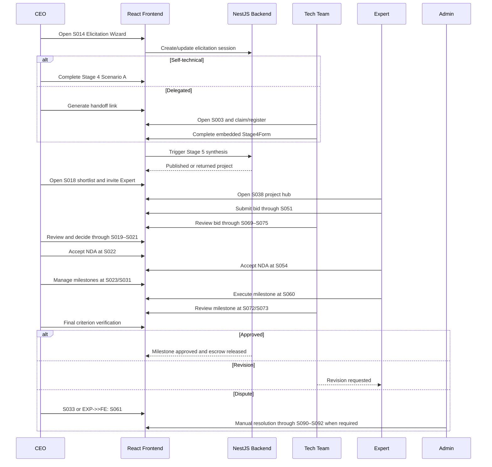

## 9.2 Service-purchase lifecycle

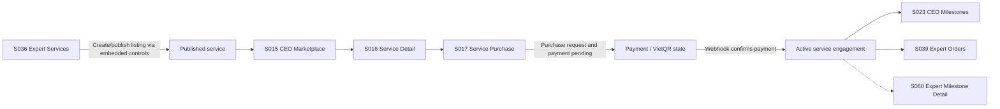

The exact post-payment navigation target must be verified from runtime behavior in `ServicePurchase`; the route tree proves the available destinations but not every `navigate()` call.

## 9.3 Dispute lifecycle

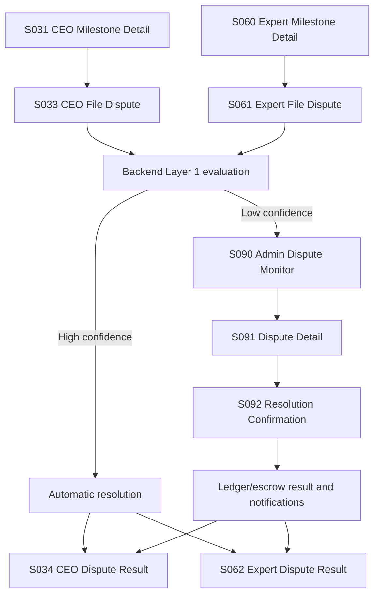

---

# 10. Screen documentation template for QA

Each routed screen should receive a test record using this structure:

## Screen `[ID] — [Name]`

**Route:**  
**Routed component:**  
**Portal/actor:**  
**Guard:**  
**Purpose:**  
**Entry points:**  
**Required URL parameters:**  
**Primary data-loading calls:**  
**Visible states:** loading, success, empty, validation error, authorization error, dependency error  
**Primary controls:**  
**Create/read/update/delete actions:**  
**Expected exits/navigation:**  
**Socket or notification effects:**  
**Persistence/state changes:**  
**Negative tests:**  
**Cross-role security tests:**  
**Refresh/deep-link test:**  
**Browser back/forward test:**  
**Evidence captured:** screenshot, network request, response, database state, socket event  
**Status:** PASS / FAIL / BLOCKED / NOT APPLICABLE

---

# 11. QA rules for diagram interpretation

1. A box with a URL is a real `App.tsx` route.
2. A component name alone does not prove that it is a modal.
3. Shared components may appear under multiple portal routes and count once per route entry.
4. Parameterized forms such as `/inbox` and `/inbox/:engagementId` are separate route entries even if they render the same component.
5. Portal shell components are not counted as additional screens.
6. A route being declared does not prove that a visible button reaches it; QA must verify navigation reachability.
7. An embedded component may still require extensive gesture-level testing even though it is not counted among the 101 screens.
8. Wrong-role access should be tested as redirect behavior, not as 404 behavior.
9. Direct deep links must be tested with valid, missing, malformed, unauthorized, and stale resource identifiers.
10. The phrase **“all 101 screens tested”** is valid only when each route has deep-link, loading, success, failure, authorization, and navigation evidence.

---

# 12. Final authoritative statement

> The AITasker frontend declares **101 route-addressable screen entries** across the public area and four actor portals. These comprise 4 public/handoff routes, 31 CEO routes, 28 Expert routes, 16 Tech Team routes, 21 Admin routes, and one wildcard error route. The application additionally contains dashboard shells and numerous non-routed wizard stages, forms, panels, modals, status views, and embedded workflow components that must be tested within their owning routed screens rather than counted as additional routes.

